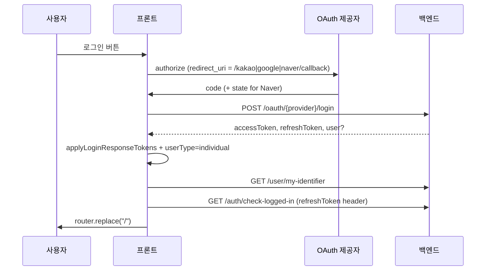

# 인증 (Authentication)

DS-Helper 프론트엔드의 로그인·세션·토큰 처리 요약입니다. API 목록은 [API_FRONTEND.md](./API_FRONTEND.md), 장애 대응은 [TROUBLESHOOTING.md](./TROUBLESHOOTING.md)를 참고하세요.

## 회원 유형

| 유형 | 로그인 UI | `userType` | 검증 API |
|------|-----------|------------|----------|
| 개인 | `/login` — 카카오·구글·네이버 | `individual` | `GET /auth/check-logged-in` |
| 기관 | `/login/org` — 이메일·비밀번호 | `organization` | `GET /auth/check-logged-in/organization` |

한 브라우저에서 동시에 두 유형을 섞어 쓰지 않도록, 로그아웃 시 `resetUserSession()`으로 초기화합니다.

## 상태 저장소

**Zustand `userStore`** (`src/lib/store/userStore.ts`)

- `persist` 이름: `user-store` (localStorage)
- 저장 필드: `user`, `userId`, `userRole`, `isVerified`, `userType`, `accessToken`, `selectedSocialLoginProvider`
- **`refreshToken`은 persist에 포함되지 않음** — 메모리 + 로그인 직후 세션에만 존재 (구현 확인 시 `partialize` 목록 참고)

주요 플래그:

| 필드 | 의미 |
|------|------|
| `isVerified` | check-logged-in 성공 여부 |
| `accessToken` | Bearer로 대부분 API에 사용 (기관 검증 포함) |
| `refreshToken` | 개인 check-logged-in 전용 헤더 |
| `userId` / `userRole` | `GET /user/my-identifier` 이후 보강 |

### 개발용 모의 로그인

```ts
const DEV_MOCK_LOGGED_IN_INDIVIDUAL = false; // 절대 true로 커밋하지 말 것
```

`true`면 로그인 없이 개인 회원 + 고정 토큰으로 API 호출 테스트 가능.

## 개인 회원 — SNS OAuth 흐름



### 콜백 페이지

| 제공자 | 경로 | 컴포넌트 |
|--------|------|----------|
| 카카오 | `/kakao/callback` | `KakaoCallback.tsx` |
| 구글 | `/google/callback` | `GoogleCallback.tsx` |
| 네이버 | `/naver/callback` | `NaverCallback.tsx` |

공통 후처리: `completeIndividualSnsLogin()` (`src/lib/oauth/completeIndividualSnsLogin.ts`)

1. `applyLoginResponseTokens` — 응답 body에서 `accessToken` / `refreshToken` / `token` / nested `data.*` 파싱
2. **refreshToken 필수** — 없으면 에러
3. `getMyIdentifier()` → `userId`, `userRole`
4. `checkAuthStatus({ force: true })`
5. 홈으로 이동

### 카카오만 프론트에서 authorize URL 생성

- `buildKakaoAuthorizeUrl()` — REST API 키를 `client_id`로 사용
- 구글·네이버는 백엔드 `login-url` 받은 뒤 `replaceOAuthAuthorizeRedirectUri`로 redirect 수정

## 기관 회원 — 이메일 로그인

1. `POST /auth/login/organization` (`login/org.tsx`)
2. `applyLoginResponseTokens(res.data)`
3. `setUserType('organization')`
4. `getMyIdentifier()` → id/role
5. `checkAuthStatus({ force: true })`

가입: `POST /auth/join/organization` (`authOrganization.tsx`)

## 앱 기동 시 인증 (`_app.tsx`)

1. 클라이언트 hydrate 후 `checkAuthStatus()` 1회
2. `isVerified`이고 `userType` 있으면 스킵
3. 토큰 없으면 check API 호출 **지연** (OAuth 레이스 방지)
4. 성공 시 `getMyIdentifier()`로 id/role 보강

## Axios와 토큰

`src/lib/apis/axios.tsx`

| 요청 | Authorization |
|------|----------------|
| 일반 API | `Bearer {accessToken}` |
| `/auth/check-logged-in/organization` | `Bearer {accessToken}` |
| `/auth/check-logged-in` (개인) | **헤더 없음** — `getCheckAuth`가 `refreshToken` 헤더 별도 전달 |
| OAuth login, 기관 login POST | 토큰 미부착 |

`withCredentials: true` — HttpOnly 쿠키가 백엔드와 함께 쓰일 수 있음. `getToken()` (`auth.ts`)은 쿠키 직접 읽지 않고 null 반환.

### 401 / 403

- **401** (check-logged-in 제외): `resetUserSession()` — 로그인 UI로 유도는 페이지별
- **403**: 예약 API 외 alert 가능

## 로그아웃

`src/lib/utils/logout.ts`

1. `POST /logout`
2. `resetUserSession()` — Zustand + localStorage `user-store` 정리는 `clearAuthState` 등 페이지에서 병행 가능

## UI에서 로그인 필요 여부

- `isAuthenticated()` (`lib/utils/auth.ts`) — `userType`에 맞는 check API 호출, `data === true`면 로그인
- 홈 `handleHelp` 등에서 사용

## SNS 연동 해제 (마이페이지)

`DELETE /user/oauth/{kakao|google|naver}` — body에 토큰 전달 (`account.tsx`)

## 체크리스트 (기능 추가 시)

- [ ] `userType` 분기 필요한가 (개인 vs 기관 API)
- [ ] 새 API가 OAuth login URL에 토큰을 붙이면 안 되는가 → `shouldAttachAuthorization`
- [ ] 로그인 직후 refreshToken 저장 전에 check-auth 호출하지 않는가
- [ ] 401 시 세션 초기화 UX

## 관련 파일

| 파일 | 역할 |
|------|------|
| `lib/store/userStore.ts` | 세션 상태 |
| `lib/apis/axios.tsx` | 인터셉터 |
| `lib/apis/authUser.tsx` | 개인 OAuth·check |
| `lib/apis/authOrganization.tsx` | 기관 login·check |
| `lib/oauth/completeIndividualSnsLogin.ts` | SNS 로그인 완료 |
| `lib/utils/auth.ts` | isAuthenticated |
| `lib/utils/logout.ts` | 로그아웃 |
| `pages/_app.tsx` | 앱 기동 검증 |

## 관련 문서

- [INTEGRATIONS.md](./INTEGRATIONS.md)
- [SECURITY.md](./SECURITY.md)
- [BACKEND.md](./BACKEND.md)
