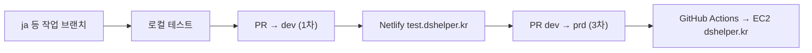

# 배포

## 환경 요약

| 환경 | URL | 프론트 배포 | API |
|------|-----|-------------|-----|
| 프로덕션 | https://dshelper.kr | AWS EC2 + pm2 | `NEXT_PUBLIC_API_URL` → `https://server.dshelper.kr` |
| 테스트 | https://test.dshelper.kr | Netlify | `NEXT_PUBLIC_TEST_API_URL` → `https://be-test.dshelper.kr` |
| 어드민 | https://admin.dshelper.kr | Netlify | [DS-Helper/admin](https://github.com/DS-Helper/admin) (별도 레포) |

호스트 분기: [ENV.md](./ENV.md), `src/lib/config/domainEnv.ts`.

## 브랜치·배포 흐름 (권장)

기능 개발은 **작업 브랜치(예: `ja`)** 에서 진행합니다.



| 단계 | Git | 배포 대상 |
|------|-----|-----------|
| 1 | `ja`(등)에서 개발·커밋 | 로컬 `npm run dev` |
| 2 | **`dev`로 PR** (1차 통합 테스트) | **Netlify** → https://test.dshelper.kr |
| 3 | 검증 후 **`prd`로 PR** (실서비스 반영) | **EC2** → https://dshelper.kr (Actions 자동) |

- `prd`에 merge/push 시 **즉시 프로덕션**이므로 2단계 Netlify QA를 거친 뒤 진행합니다.
- `main`은 GitHub 기본 브랜치이며, 실제 배포 트리거는 **`dev` → Netlify**, **`prd` → EC2** 입니다.

자세한 협업 규칙: [CONVENTIONS.md](./CONVENTIONS.md).

## 프로덕션 (EC2)

### 트리거

- GitHub Actions: `.github/workflows/deploy.yml`
- **`prd` 브랜치 push** 시 자동 CI/CD

### 서버 절차 (워크플로가 SSH로 실행)

1. `nvm use 20`
2. `cd ~/frontend`
3. `git pull origin prd`
4. `npm install`
5. `npm run build`
6. `pm2 reload dshelper` (없으면 `pm2 start dshelper`)

### 필요 시크릿 (GitHub)

- `EC2_HOST`
- `EC2_USER`
- `EC2_SSH_KEY`

### 서버 환경 변수

EC2 `~/frontend`의 `.env`에 프로덕션 값 설정.

| 변수 | 예시 값 |
|------|---------|
| `NEXT_PUBLIC_API_URL` | `https://server.dshelper.kr` |
| `NEXT_PUBLIC_APP_ORIGIN` | `https://dshelper.kr` |
| `NEXT_PUBLIC_*_OAUTH_REDIRECT_URI` | `https://dshelper.kr/{provider}/callback` |
| 카카오 지도/REST | 프로덕션 키 (대시보드만) |

### EC2 수동 점검 (배포 후)

```bash
cd ~/frontend && git log -1 --oneline
pm2 status
pm2 logs dshelper --lines 50
```

## 테스트 (Netlify)

| 항목 | 권장 설정 |
|------|-----------|
| 사이트 URL | https://test.dshelper.kr |
| Production branch | **`dev`** (merge 시 자동 배포) |
| Build command | `npm run build` |
| Publish directory | `.next` (Next.js on Netlify — 프로젝트에 맞게 `next` 플러그인 사용 시 플러그인 기본값 따름) |
| Node version | **20** (EC2·로컬과 동일) |

### Netlify 환경 변수 (키 이름만 — 값은 대시보드에만)

| 변수 | 용도 |
|------|------|
| `NEXT_PUBLIC_TEST_API_URL` | `https://be-test.dshelper.kr` (IP 허용 후) |
| `NEXT_PUBLIC_TEST_APP_ORIGIN` | `https://test.dshelper.kr` |
| `NEXT_PUBLIC_KAKAO_OAUTH_REDIRECT_URI_TEST` | `https://test.dshelper.kr/kakao/callback` |
| `NEXT_PUBLIC_GOOGLE_OAUTH_REDIRECT_URI_TEST` | `https://test.dshelper.kr/google/callback` |
| `NEXT_PUBLIC_NAVER_OAUTH_REDIRECT_URI_TEST` | `https://test.dshelper.kr/naver/callback` |
| `NEXT_PUBLIC_KAKAO_MAP_JAVASCRIPT_KEY_TEST` | 지도 SDK |
| `NEXT_PUBLIC_KAKAO_REST_API_KEY_TEST` | REST (클라이언트) |
| `KAKAO_REST_API_KEY_TEST` | `/api/kakao-address` 서버 Route |

전체 목록: [ENV.md](./ENV.md). Redirect·지도 도메인: [INTEGRATIONS.md](./INTEGRATIONS.md).

### Netlify 배포 확인

1. `dev` merge 후 Netlify Deploys에서 **Published** 확인
2. https://test.dshelper.kr 접속 → Network에서 API host가 `be-test.dshelper.kr`인지
3. SNS 로그인·지도(휴지통) smoke test → [QA.md](./QA.md)

### Deploy Preview (선택)

PR마다 Netlify Preview URL이 생기면, OAuth·카카오 콘솔에 **해당 preview origin**을 추가해야 로그인·지도가 동작할 수 있습니다. 미등록 시 preview에서는 OAuth만 실패할 수 있습니다.

## 어드민

| 항목 | 내용 |
|------|------|
| 레포 | https://github.com/DS-Helper/admin |
| 구조 | 프론트·백엔드 **모노레포**, **브랜치로 분리** |
| URL | https://admin.dshelper.kr (Netlify) |
| API | 사용자 앱과 **별도** — admin 레포 env·Swagger 확인 |

사용자 앱(`frontend`)과 배포 브랜치·Netlify 사이트가 다를 수 있습니다. 어드민 변경은 **admin 레포 README·브랜치 정책**을 따릅니다.

## 로컬 vs 배포 빌드

```bash
npm run build
npm run start   # 프로덕션 모드 로컬 검증
```

## 배포 전 체크리스트

- [ ] `npx tsc --noEmit` / `npm run lint`
- [ ] [QA.md](./QA.md) 해당 기능 체크
- [ ] OAuth Redirect URI가 대상 도메인에 등록됨
- [ ] 카카오 지도 JavaScript 키 Web 도메인 허용
- [ ] `dev` Netlify에서 1차 확인 후 `prd` PR
- [ ] `be-test` API는 **IP 허용** 필요 ([BACKEND.md](./BACKEND.md))

## 롤백

### EC2 (프로덕션)

1. `cd ~/frontend`
2. `git fetch && git checkout <이전-커밋-해시>` (또는 `git revert` 후 `prd` push)
3. `npm install && npm run build`
4. `pm2 reload dshelper`
5. 필요 시 [CHANGELOG.md](./CHANGELOG.md)에 롤백 기록

긴급 시 GitHub Actions 재실행보다 **서버에서 직전 커밋으로 복구**가 빠를 수 있습니다.

### Netlify (테스트)

1. Netlify → Deploys → 이전 성공 배포 → **Publish deploy**
2. env 변경이 원인이면 환경 변수 되돌린 뒤 **Trigger deploy**

## 관련 문서

- [ONBOARDING.md](./ONBOARDING.md)
- [CHANGELOG.md](./CHANGELOG.md)
